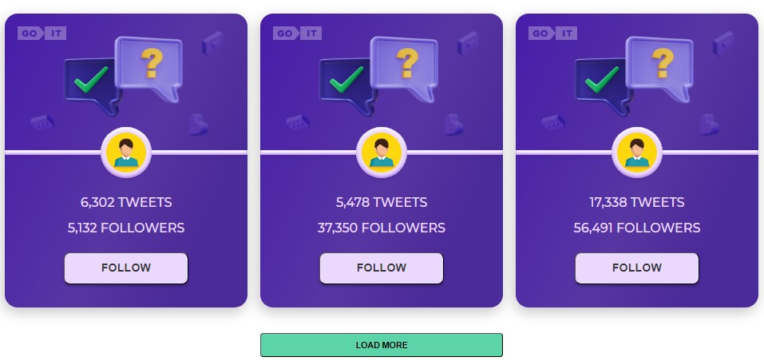
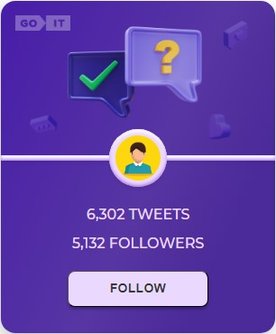
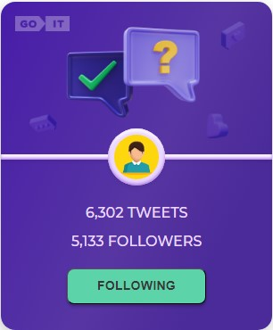

<h1 align="center">Tweets App</h1>

Welcome to my simple App.

Here you can go to the Tweets page and mark the users you are interested in. User cards arrive three at a time, and with the help of the "Load more" button, you can get the next three users.

